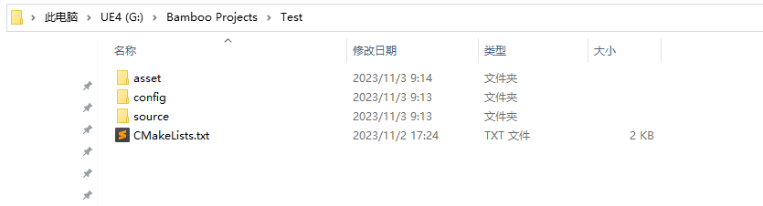
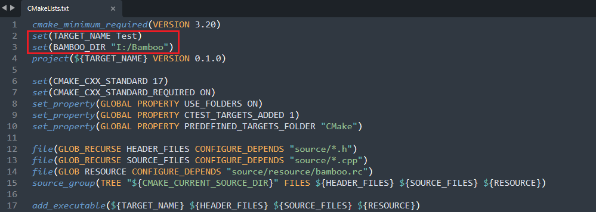

# Bamboo

## What is Bamboo
**Bamboo** is a lightweight game engine with high-fidelity graphics rendering and simulation functions, provides a flexible gameplay framework, and will mainly focus on AIGC technologies in the future. Bamboo uses vulkan as the only graphics/computing api, and is written in C++17.


## Features
- UE-like Editor
- Static/Skeletal mesh rendering
- Asset System
- Pixel-perfect picking and outlining
- 3D translation/rotation/scale gizmos
- Reflection and serialization system
- Physically-Based Rendering
- Deferred and forward mixing rendering paths
- Multiple light types(Directional/Sky/Point/Spot)
- Postprocessing(Color Grading)
- Play in Editor(PIE)
- Physicis System
- Texture Compression
- Engine/Editor/Game code isolation

## How to build
**I just wanna give it a try**

Well, if you're using Windows, you can download the prebuild package(Release.zip) in the latest release page:)

**Supported Platforms**
- Windows
- Linux(WIP)
- MacOS(TODO)

**Prerequites**
- [Git](http://git-scm.com/downloads).
- [CMake](https://cmake.org/download/). Version 3.20.0 or later is required.
- [Vulkan Sdk](https://www.lunarg.com/vulkan-sdk/). Verison 1.3 or later is prefered.
- [Visual Studio](https://visualstudio.microsoft.com/). Version 2022 is prefered.

**Step 1.** Clone the Bamboo repository. Now the engine and editor modules will be compiled to two static libraries rather than one engine library and one editor executable.

```shell
git clone https://github.com/Code-Guy/Bamboo.git
```

**Step 2.** Download the lastest version's Project.zip file, unzip to somewhere. It's a demo project which relies on the engine and editor sources to compile, and contains "asset" "config" "source" and "CMakeLists.txt" four items.


**Step 3.** Open "CMakeLists.txt" file, modify TARGET_NAME property to whatever you want, and modify BAMBOO_DIR to the absolute path of where you put Bamboo repository. **(That's very important!)**


**Step 4.** Go to Project folder, use CMake to generate build files using any [desired generator](https://cmake.org/cmake/help/latest/manual/cmake-generators.7.html). The generating command maybe like this:

```shell
cmake -G "Visual Studio 17 2022" -A x64 -S . -B build
```

**Step 5.** Then you can use any IDE according to you selected generator, but you can also just build straight from CMake.

```shell
cmake --build build --config Release
```

## External libraries
All external libraries' source codes have been integrated into this repo, so there is no need to clone those libraries manually:)
- [vma](https://gpuopen.com/vulkan-memory-allocator/)(vulkan resource management)
- [glm](https://glm.g-truc.net/0.9.9/)(math)
- [glfw](https://www.glfw.org/)(window and input)
- [imgui](https://www.dearimgui.com/)(gui)
- [spdlog](https://github.com/gabime/spdlog)(logging)
- [yaml-cpp](https://github.com/jbeder/yaml-cpp)(config)
- [tinygltf](https://github.com/syoyo/tinygltf)(model loading)
- [ktx](https://github.com/KhronosGroup/KTX-Software)(texture compression and loading)
- [cereal](https://uscilab.github.io/cereal/)(serialization)
- [json](https://www.json.org/json-en.html)(required by cereal)
- [rttr](https://www.rttr.org/)(reflection)
- [eventpp](https://github.com/wqking/eventpp)(event system)
- [jolt](https://github.com/jrouwe/JoltPhysics)(physics system)
- [random](https://github.com/effolkronium/random)(random number generator)
