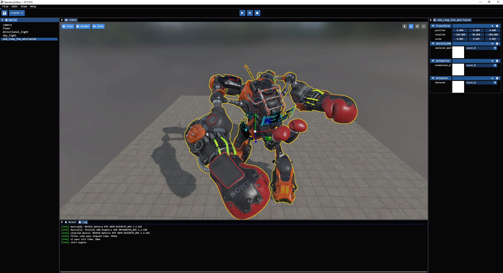
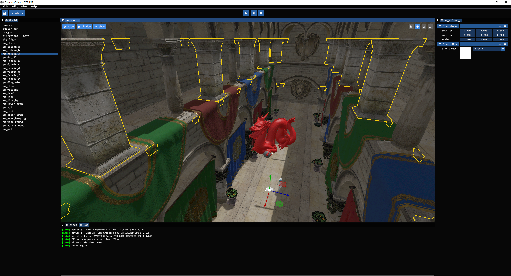
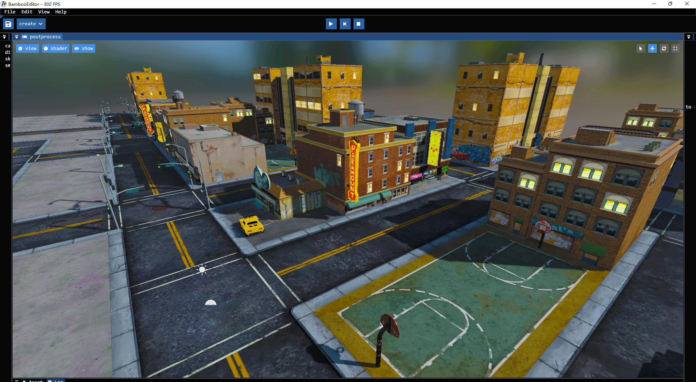

# Bamboo

## What is Bamboo
**Bamboo** is a lightweight simulation engine that supports high-fidelity graphics rendering, and will mainly focus on AIGC and cloud rendering technologies in the future. **Bamboo** uses vulkan as the only graphics/computing api, and is written in C++17.






## Features
- UE-like Editor
- Flexible panel docking
- Static mesh rendering
- Skeletal mesh rendering
- Asset drag-drop importing
- Asset drag-drop placing
- Pixel-perfect picking and outline highlighting
- 3D translation/rotation/scale gizmos
- Reflection and serialization system
- Physically-Based Rendering
- Deferred and forward mixing rendering paths
- Multiple light types(Directional/Sky/Point/Spot)
- Shadow rendering for every light type
- Postprocessing(Color Grading)

## How to build
**I don't want to build anyway**
Well, if you're using Windows, you can download the prebuild engine zip file(Bamboo.zip) in the release page:)

**Supported Platforms**
- Windows
- Linux(WIP)
- MacOS(ToDo)

**Prerequites**
- [Git](http://git-scm.com/downloads).
- [CMake](https://cmake.org/download/). Version 3.20.0 or later is required.
- [Vulkan Sdk](https://www.lunarg.com/vulkan-sdk/). Verison 1.3 or later is prefered.
- [Visual Studio](https://visualstudio.microsoft.com/). Version 2022 is prefered.

**Step 1.** Clone the sources and create a build directory.

```shell
git clone https://github.com/Code-Guy/Bamboo.git
cd Bamboo
mkdir build && cd build
```
**Step 2.** Use CMake to generate project file using any [desired generator](https://cmake.org/cmake/help/latest/manual/cmake-generators.7.html). 

```shell
cmake -G "Visual Studio 17 Win64" -S . -B build
```

**Step 3.** You can use any IDE according to you selected generator, but you can also just build straight from CMake.

```shell
cmake --build build --config Release
```

**Step 4.** Don't forget to download Bamboo.zip file from github repo, unzip it, and copy the asset folder to the path of BambooEditor.exe to cover the existing one, then we can run the Bamboo editor finally! 

## External libraries
All external libraries' source codes have been integrated into this repo, so there is no need to clone those libraries manually:)
- [vma](https://gpuopen.com/vulkan-memory-allocator/)(vulkan resource management)
- [glm](https://glm.g-truc.net/0.9.9/)(math)
- [glfw](https://www.glfw.org/)(window and input)
- [imgui](https://www.dearimgui.com/)(gui)
- [spdlog](https://github.com/gabime/spdlog)(logging)
- [yaml-cpp](https://github.com/jbeder/yaml-cpp)(config)
- [tinygltf](https://github.com/syoyo/tinygltf)(model loading)
- [ktx](https://github.com/KhronosGroup/KTX-Software)(texture loading)
- [cereal](https://uscilab.github.io/cereal/)(serialization)
- [json](https://www.json.org/json-en.html)(required by cereal)
- [rttr](https://www.rttr.org/)(reflection)
- [eventpp](https://github.com/wqking/eventpp)(event system)